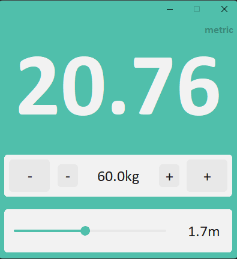

# BMI Calculator

A simple and elegant Body Mass Index (BMI) calculator built with Python using the `customtkinter` library.



## Features

- User-friendly interface with modern design.
- Supports metric units.
- Displays real-time BMI value.
- Adjustable weight and height with buttons and slider.

## How to Run

1. Make sure you have Python installed.
2. Install `customtkinter` if not already installed:

```bash
pip install customtkinter
```

3. Run the application:

```bash
python bmi.py
```

## Screenshot

The app looks like this:


## Author

Created by **Basem-2004**